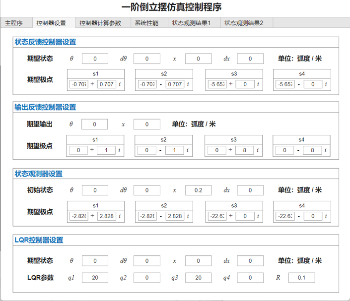

# Pedulum GUI
 A Matlab GUI Simulator for first-order pedulum. Support linear model, non-linear model and discrete linear model with 3 kinds of controllers including state-feedback contorller, output-feedback contorller, LQR contorller.


## Requirements
- Matlab 2021a + (Recommand 2023b)
- Simulink 2021a + (Recommand 2023b)

## Usage
1. Open Matalb with repo folder
2. Run the script:
```
pedulum_gui
```

## Screenshot
### Main GUI


### Controllers Setting


### Controllers Parameters


### System Poles


### State Observers 1


### State Observers 2

